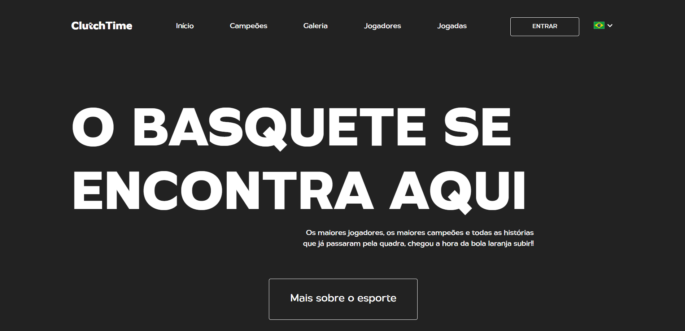

<h1 id="inicio" align="center">ClutchTime</h1>
<h2 align="center">O basquete se encontra aqui</h2>

<div align="center">
    
</div><br/>

<p align="center">
    <b weight="bold"> ClutchTime </b>
    <b weight="bold">✅ Concluído </b>
</p>

<p align="center">
    <a href="#sobre">Sobre</a> •
    <a href="#paginas">Páginas</a> •
    <a href="#tecnologias">Tecnologias</a> •
    <a href="#funcionalidades">Funcionalidades</a> •
    <a href="#aprendizados">Aprendizados</a> •
    <a href="#rodando">Como executar</a> •
    <a href="#autor">Autor</a> •
    <a href="#licenca">Licença</a>
</p>

<h4 align="center">
    <a href="https://clutch-time.vercel.app">Clique para visitar o nosso site</a> <!-- Ainda vou colocar o site no ar -->
</h4>
<br/>

<h2 id="sobre">💻 Sobre o projeto</h2>

<p> 🏀 <b>ClutchTime</b> - É uma plataforma que introduz um pouco sobre o mundo do basquete, mostrando alguns dos maiores campeões e melhores jogadores do mundo, é aqui onde a paixão pelo jogo começa!!</p>
<br/>

<h2 id="paginas">🗂️ Seções</h2>

### 🏡 **Home**

- Na seção **Início** é mostrado uma breve introdução sobre o projeto;
- Na seção **Campeões** é mostrado os maiores campeões da **NBA**, destacando quantos títulos cada franquia conseguiu conquistar ao longo do tempo;
- Na seção **Galeria** temos uma pequena introdução da nossa galeria;
- Na seção **Jogadores** temos informações sobre alguns dos principais jogadores da liga, que coincidentemente, também são o futuro dela;
- Na seção **Jogadas** é possível ver algumas das melhroes jogadas da temporada, desde **Wembanyama** até um dos candidatos a MVP da temporada 24/25, **Shai Gilgeous-Alexander**;

<br/>

<h2 id="tecnologias">🛠️ Dependências e Linguagens</h2>

### 🟡 Linguagens

Para a criação do Front-end foram utilizados [HTML](https://developer.mozilla.org/pt-BR/docs/Web/HTML), [SASS](https://sass-lang.com) e [JS](https://developer.mozilla.org/pt-BR/docs/Web/JavaScript).
 
### 🫁 Dependências 

- [ReactJS](https://react.dev)
- [Vite](https://vite.dev)
- [Framer Motion](https://framermotion.framer.website)
- [i18next](https://www.i18next.com) 
- [React Icons](https://react-icons.github.io/react-icons/)
- [Swiper](https://swiperjs.com)

<br/>

<h2 id="funcionalidades"> ⚙️ Funcionalidades </h2>

[x] **Menu dropdown (Mudança de idioma)**: Na seção `Início` é possível trocarmos o idioma da página de Português para Inglês e vice-versa;

[x] **Slider de jogadas**: Na seção `Jogadas` é possível ver cada uma das jogadas, seja deslizando o Slider para o lado ou clicando nas setas de 'Anterior' e 'Próximo';

<br/>

<h2 id="aprendizados">💻 Aprendizados</h2>

- Utilização e funcionamento do **React**;
- Mudança de idioma da página utilizando **i18next**;
- Utilização de **Framer Motion** para animação da página;
- Utilização de **Swiper** para criação do slider de vídeos

<br/>

<h2 id="rodando">🚀 Como executar o projeto </h2>

### Pré-requisitos 

Antes de começar, você vai precisar ter instalado em sua máquina o [Git](https://git-scm.com). 
Além disto, é bom ter um editor para trabalhar com o código como o [VSCode](https://code.visualstudio.com/) ou algum outro de sua preferência.

#### Rodando o servidor

```bash

# Clone este repositório 
$ git clone https://github.com/lukeyusuke/clutchtime.git

# Entre na pasta do projeto no seu terminal/cmd
$ cd clutchtime

# Instale as dependências
$ npm install

# Execute a aplicação
$ npm run dev

# O servidor inciará na porta:5173 - acesse http://localhost:5173

``` 

<br/>

<h2 id="autor">👨🏾‍💻 Autor </h2>

<table>
    <td align="center"><a href="https://www.linkedin.com/in/lukeyusuke"><br /><sub><b>Luke Yusuke</b></sub></a></td>
</table>

<p>
    <a target="_blank" href="mailto:lukedev09@gmail.com" alt="Link para Email"> 
        
    </a>
    <a target="_blank" href="https://www.github.com/lukeyusuke"> 
        
    </a>
    <a target="_blank" href="https://www.linkedin.com/in/lukeyusuke"> 
        
    </a>
</p>

<h2 id="licenca">📝 Licença</h2>

<p> Projeto feito sob licença <a href="https://github.com/lukeyusuke/pronto-falei/blob/main/LICENSE"/>MIT</a> </p>
<p> Desenvolvido por <b style="color:#9F40EB">Luke Yusuke 🤠</b></p>
